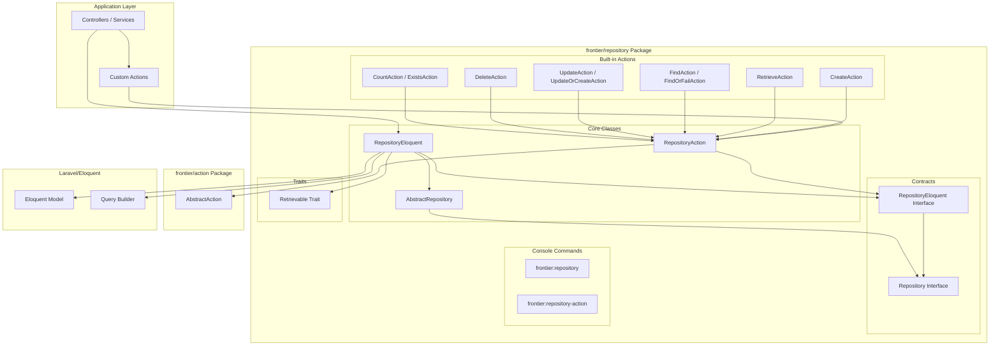
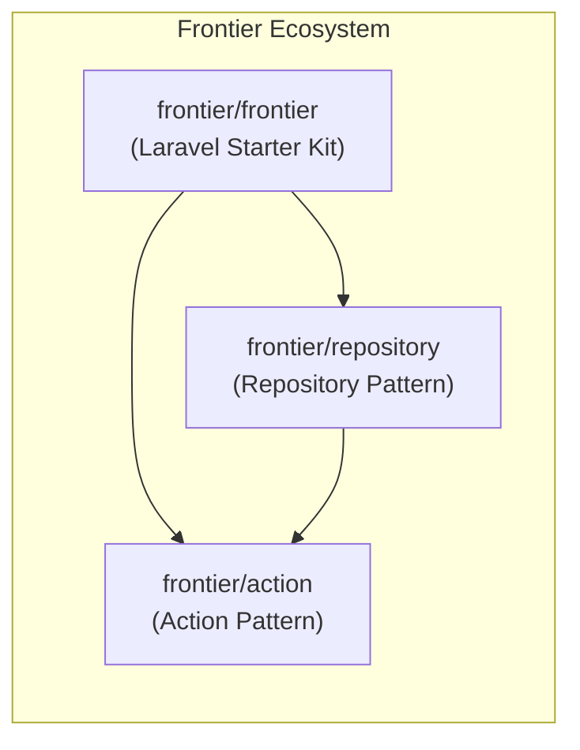

# Frontier Repository - AI Guide

> **Package**: `frontier/repository`  
> **Version**: Compatible with Laravel 10, 11, 12  
> **Dependency**: `frontier/action` ^1.0  
> **Namespace**: `Frontier\Repositories`

## Overview

The `frontier/repository` package implements the **Repository Pattern** for Laravel applications, providing a clean abstraction layer between your business logic and Eloquent ORM. It's a companion package to `frontier/frontier` (Laravel Starter Kit) and integrates with `frontier/action` for the Action pattern.

### Key Benefits

- **Separation of concerns** - Decouples business logic from data access
- **Testability** - Easy to mock repositories in unit tests
- **Consistency** - Standardized CRUD operations across all models
- **Flexibility** - Built-in support for filtering, sorting, pagination, scopes, and joins
- **Action integration** - Pre-built actions for common repository operations

---

## Architecture



---

## Core Components

### Contracts

| Contract | Description |
|----------|-------------|
| [Repository](file:///var/www/html/rai/up/frontier-repository/src/Contracts/Repository.php) | Base marker interface for all repositories |
| [RepositoryEloquent](file:///var/www/html/rai/up/frontier-repository/src/Contracts/RepositoryEloquent.php) | Full interface defining 20+ CRUD and query methods |

### Core Classes

| Class | Description |
|-------|-------------|
| [AbstractRepository](file:///var/www/html/rai/up/frontier-repository/src/AbstractRepository.php) | Base abstract class implementing `Repository` contract |
| [RepositoryEloquent](file:///var/www/html/rai/up/frontier-repository/src/RepositoryEloquent.php) | Main implementation with CRUD operations and query building |
| [RepositoryAction](file:///var/www/html/rai/up/frontier-repository/src/RepositoryAction.php) | Base action class extending `frontier/action` with repository support |

### Traits

| Trait | Description |
|-------|-------------|
| [Retrievable](file:///var/www/html/rai/up/frontier-repository/src/Traits/Retrievable.php) | Query building trait for filters, scopes, joins, sorting, pagination |

### Built-in Actions

| Action | Method Signature | Description |
|--------|------------------|-------------|
| [CreateAction](file:///var/www/html/rai/up/frontier-repository/src/Actions/CreateAction.php) | `handle(array $values): Model` | Create a new record |
| [RetrieveAction](file:///var/www/html/rai/up/frontier-repository/src/Actions/RetrieveAction.php) | `handle(array $columns, array $options): Collection\|LengthAwarePaginator` | Retrieve records with optional pagination |
| [FindAction](file:///var/www/html/rai/up/frontier-repository/src/Actions/FindAction.php) | `handle(array $conditions, array $columns, array $with): ?Model` | Find single record |
| [FindOrFailAction](file:///var/www/html/rai/up/frontier-repository/src/Actions/FindOrFailAction.php) | `handle(array $conditions, array $columns, array $with): Model` | Find or throw exception |
| [UpdateAction](file:///var/www/html/rai/up/frontier-repository/src/Actions/UpdateAction.php) | `handle(array $conditions, array $values): int` | Update matching records |
| [UpdateOrCreateAction](file:///var/www/html/rai/up/frontier-repository/src/Actions/UpdateOrCreateAction.php) | `handle(array $conditions, array $values): Model` | Update or create record |
| [DeleteAction](file:///var/www/html/rai/up/frontier-repository/src/Actions/DeleteAction.php) | `handle(array $conditions): bool` | Delete matching records |
| [CountAction](file:///var/www/html/rai/up/frontier-repository/src/Actions/CountAction.php) | `handle(array $conditions): int` | Count matching records |
| [ExistsAction](file:///var/www/html/rai/up/frontier-repository/src/Actions/ExistsAction.php) | `handle(array $conditions): bool` | Check if records exist |

---

## Design Patterns

### 1. Repository Pattern
The core pattern - abstracts data access logic behind a consistent interface. Each repository encapsulates all queries for a specific model.

### 2. Action Pattern Integration
Integrates with `frontier/action` package to encapsulate single operations as classes. The `RepositoryAction` base class provides repository access to actions.

### 3. Interface Segregation
Uses `Repository` as marker interface and `RepositoryEloquent` for full implementation, allowing future non-Eloquent implementations.

### 4. Template Method Pattern
`Retrievable` trait provides a template for building complex queries with hooks for filters, scopes, joins, sorting, and pagination.

### 5. Fluent Interface
Query building methods return `$this` for method chaining.

---

## Installation

```bash
composer require frontier/repository
```

The package auto-registers its service provider via Laravel's package discovery.

---

## Usage Examples

### Creating a Repository

Use the artisan command to scaffold a new repository:

```bash
php artisan frontier:repository UserRepository
```

This creates `app/Repositories/UserRepository.php`:

```php
<?php

namespace App\Repositories;

use App\Models\User;
use Frontier\Repositories\RepositoryEloquent as FrontierRepository;

class UserRepository extends FrontierRepository
{
    public function __construct(User $model)
    {
        parent::__construct($model);
    }

    // Add custom query methods here
    public function findActiveUsers(): Collection
    {
        return $this->retrieve(['*'], [
            'filters' => ['is_active' => true],
            'sort' => 'created_at',
            'direction' => 'desc'
        ]);
    }
}
```

### Binding to Interface

Create an interface and bind it in a service provider:

```php
// app/Repositories/Contracts/UserRepositoryInterface.php
<?php

namespace App\Repositories\Contracts;

use Frontier\Repositories\Contracts\RepositoryEloquent;

interface UserRepositoryInterface extends RepositoryEloquent
{
    public function findActiveUsers(): Collection;
}
```

```php
// app/Providers/RepositoryServiceProvider.php
<?php

namespace App\Providers;

use App\Repositories\Contracts\UserRepositoryInterface;
use App\Repositories\UserRepository;
use Illuminate\Support\ServiceProvider;

class RepositoryServiceProvider extends ServiceProvider
{
    public function register(): void
    {
        $this->app->bind(
            UserRepositoryInterface::class,
            UserRepository::class
        );
    }
}
```

### Basic CRUD Operations

```php
<?php

use App\Repositories\UserRepository;

class UserController extends Controller
{
    public function __construct(
        protected UserRepository $users
    ) {}

    // CREATE
    public function store(Request $request): User
    {
        return $this->users->create([
            'name' => $request->name,
            'email' => $request->email,
            'password' => bcrypt($request->password),
        ]);
    }

    // READ - Single record
    public function show(int $id): ?User
    {
        return $this->users->find(['id' => $id]);
        // Or throw 404 if not found:
        // return $this->users->findOrFail(['id' => $id]);
    }

    // READ - Multiple records with pagination
    public function index(Request $request): LengthAwarePaginator
    {
        return $this->users->retrievePaginate(
            columns: ['id', 'name', 'email'],
            options: [
                'per_page' => 15,
                'sort' => 'created_at',
                'direction' => 'desc',
                'with' => ['profile', 'roles'],
            ]
        );
    }

    // UPDATE
    public function update(Request $request, int $id): int
    {
        return $this->users->update(
            conditions: ['id' => $id],
            values: $request->only(['name', 'email'])
        );
    }

    // DELETE
    public function destroy(int $id): bool
    {
        return $this->users->delete(['id' => $id]);
    }
}
```

### Advanced Retrieve Options

The `retrieve()` and `retrievePaginate()` methods accept an `$options` array:

```php
$users = $this->users->retrieve(['*'], [
    // Filtering (uses model's scopeFilter if available)
    'filters' => [
        'status' => 'active',
        'role' => 'admin',
    ],
    
    // Call model scopes
    'scopes' => [
        'verified',                    // Calls $model->verified()
        'olderThan' => [18],           // Calls $model->olderThan(18)
    ],
    
    // Custom joins
    'joins' => [
        'withProfiles',                // Calls $model->withProfiles()
        'leftJoinOn' => ['orders'],    // Calls $model->leftJoinOn('orders')
    ],
    
    // Eager load relationships
    'with' => ['profile', 'roles', 'permissions'],
    
    // Sorting (supports multiple columns)
    'sort' => ['created_at', 'name'],
    'direction' => ['desc', 'asc'],
    
    // Grouping
    'group_by' => ['department_id'],
    
    // Distinct results
    'distinct' => true,
    
    // Offset/limit (for non-paginated queries)
    'offset' => 10,
    'per_page' => 25,
]);
```

### Using Repository Actions

Create a custom action that extends `RepositoryAction`:

```bash
php artisan frontier:repository-action RegisterUser
```

```php
<?php

namespace App\Actions;

use App\Repositories\UserRepository;
use Frontier\Repositories\RepositoryAction as FrontierAction;
use Illuminate\Database\Eloquent\Model;

class RegisterUser extends FrontierAction
{
    public function __construct(UserRepository $repository)
    {
        $this->repository = $repository;
    }

    public function handle(array $data): Model
    {
        // Validation, business logic, etc.
        $data['password'] = bcrypt($data['password']);
        
        return $this->repository->create($data);
    }
}
```

Use in controller:

```php
public function register(Request $request, RegisterUser $action): User
{
    return $action->handle($request->validated());
}
```

### Using Built-in Actions

```php
use Frontier\Repositories\Actions\CreateAction;
use Frontier\Repositories\Actions\RetrieveAction;

class UserController extends Controller
{
    public function index(RetrieveAction $retrieve): Collection
    {
        return $retrieve->handle(['*'], [
            'filters' => ['is_active' => true],
            'per_page' => 15,
        ]);
    }
    
    public function store(Request $request, CreateAction $create): Model
    {
        return $create->handle($request->validated());
    }
}
```

### Transaction Support

```php
$result = $this->users->transaction(function () use ($userData, $profileData) {
    $user = $this->users->create($userData);
    $this->profiles->create([...$profileData, 'user_id' => $user->id]);
    
    return $user;
});
```

### Bulk Operations

```php
// Insert multiple records
$this->users->insert([
    ['name' => 'User 1', 'email' => 'user1@example.com'],
    ['name' => 'User 2', 'email' => 'user2@example.com'],
]);

// Upsert (insert or update)
$this->users->upsert(
    values: [
        ['email' => 'john@example.com', 'name' => 'John Updated'],
        ['email' => 'jane@example.com', 'name' => 'Jane New'],
    ],
    uniqueBy: ['email'],
    update: ['name']
);

// Process in chunks (memory efficient)
$this->users->chunk(100, function ($users) {
    foreach ($users as $user) {
        // Process each user
    }
});
```

---

## Relationship to frontier/frontier

This package is a **companion package** to `frontier/frontier` (Laravel Starter Kit):



- **frontier/frontier**: The main Laravel starter kit that may include this package
- **frontier/action**: Required dependency - provides the base `AbstractAction` class
- **frontier/repository**: This package - adds Repository pattern support

---

## Extension & Customization Guide

### Creating Custom Repositories

1. **Extend `RepositoryEloquent`**:
```php
class ProductRepository extends RepositoryEloquent
{
    public function __construct(Product $model)
    {
        parent::__construct($model);
    }

    // Add domain-specific methods
    public function findInStock(): Collection
    {
        return $this->retrieve(['*'], [
            'scopes' => ['inStock'],
            'sort' => 'stock_count',
            'direction' => 'desc',
        ]);
    }

    public function lowStockProducts(int $threshold = 10): Collection
    {
        return $this->where(['stock_count' => ['<', $threshold]])
            ->getBuilder()
            ->get();
    }
}
```

### Overriding Methods

```php
class AuditedUserRepository extends UserRepository
{
    public function create(array $values): Model
    {
        $values['created_by'] = auth()->id();
        
        return parent::create($values);
    }

    public function update(array $conditions, array $values): int
    {
        $values['updated_by'] = auth()->id();
        
        return parent::update($conditions, $values);
    }
}
```

### Custom Base Repository

Create your own base repository with shared functionality:

```php
<?php

namespace App\Repositories;

use Frontier\Repositories\RepositoryEloquent;
use Illuminate\Database\Eloquent\Model;

abstract class BaseRepository extends RepositoryEloquent
{
    // Add tenant scoping
    public function create(array $values): Model
    {
        $values['tenant_id'] = tenant()->id;
        
        return parent::create($values);
    }

    // Add soft delete support
    public function restore(array $conditions): bool
    {
        return $this->where($conditions)
            ->getBuilder()
            ->restore();
    }

    public function forceDelete(array $conditions): int
    {
        return $this->where($conditions)
            ->getBuilder()
            ->forceDelete();
    }
}
```

### Custom Actions

```php
<?php

namespace App\Actions\Users;

use App\Repositories\UserRepository;
use Frontier\Repositories\RepositoryAction;
use Illuminate\Support\Facades\Hash;

class UpdatePassword extends RepositoryAction
{
    public function __construct(UserRepository $repository)
    {
        $this->repository = $repository;
    }

    public function handle(int $userId, string $newPassword): int
    {
        return $this->repository->update(
            ['id' => $userId],
            ['password' => Hash::make($newPassword)]
        );
    }
}
```

---

## When to Use Repository Pattern vs Eloquent Directly

### Use Repository Pattern When:

| Scenario | Reason |
|----------|--------|
| **Large applications** | Consistent data access patterns across the codebase |
| **Team development** | Enforces consistent API for database operations |
| **Testability required** | Easily mock repositories in unit tests |
| **Complex queries** | Encapsulate complex query logic in one place |
| **Multiple data sources** | Abstract data source (could switch from MySQL to API) |
| **Domain-driven design** | Separate business logic from data access |

### Use Eloquent Directly When:

| Scenario | Reason |
|----------|--------|
| **Simple CRUD apps** | Minimal abstraction overhead |
| **Prototyping** | Quick iteration without extra layers |
| **One-off queries** | Inline queries in controllers acceptable |
| **Small codebases** | Additional abstraction not worth complexity |

### Hybrid Approach

It's valid to use both:
- Use repositories for core domain models
- Use Eloquent directly for simple lookup tables or admin features

---

## Artisan Commands

| Command | Description | Output Path |
|---------|-------------|-------------|
| `php artisan frontier:repository {name}` | Create a new repository class | `app/Repositories/{name}.php` |
| `php artisan frontier:repository-action {name}` | Create a new repository action class | `app/Actions/{name}.php` |

### Command Options

```bash
# Create repository (default: eloquent type)
php artisan frontier:repository UserRepository
php artisan frontier:repository UserRepository --type=eloquent

# Create repository action
php artisan frontier:repository-action CreateUser
```

---

## File Reference

| File | Purpose |
|------|---------|
| [composer.json](file:///var/www/html/rai/up/frontier-repository/composer.json) | Package configuration |
| [src/AbstractRepository.php](file:///var/www/html/rai/up/frontier-repository/src/AbstractRepository.php) | Base abstract repository class |
| [src/RepositoryEloquent.php](file:///var/www/html/rai/up/frontier-repository/src/RepositoryEloquent.php) | Main Eloquent repository implementation |
| [src/RepositoryAction.php](file:///var/www/html/rai/up/frontier-repository/src/RepositoryAction.php) | Base action class with repository support |
| [src/Contracts/Repository.php](file:///var/www/html/rai/up/frontier-repository/src/Contracts/Repository.php) | Base repository interface |
| [src/Contracts/RepositoryEloquent.php](file:///var/www/html/rai/up/frontier-repository/src/Contracts/RepositoryEloquent.php) | Full Eloquent repository interface |
| [src/Traits/Retrievable.php](file:///var/www/html/rai/up/frontier-repository/src/Traits/Retrievable.php) | Query building trait |
| [src/Actions/CreateAction.php](file:///var/www/html/rai/up/frontier-repository/src/Actions/CreateAction.php) | Create record action |
| [src/Actions/RetrieveAction.php](file:///var/www/html/rai/up/frontier-repository/src/Actions/RetrieveAction.php) | Retrieve records action |
| [src/Actions/FindAction.php](file:///var/www/html/rai/up/frontier-repository/src/Actions/FindAction.php) | Find single record action |
| [src/Actions/FindOrFailAction.php](file:///var/www/html/rai/up/frontier-repository/src/Actions/FindOrFailAction.php) | Find or throw action |
| [src/Actions/UpdateAction.php](file:///var/www/html/rai/up/frontier-repository/src/Actions/UpdateAction.php) | Update records action |
| [src/Actions/UpdateOrCreateAction.php](file:///var/www/html/rai/up/frontier-repository/src/Actions/UpdateOrCreateAction.php) | Upsert action |
| [src/Actions/DeleteAction.php](file:///var/www/html/rai/up/frontier-repository/src/Actions/DeleteAction.php) | Delete records action |
| [src/Actions/CountAction.php](file:///var/www/html/rai/up/frontier-repository/src/Actions/CountAction.php) | Count records action |
| [src/Actions/ExistsAction.php](file:///var/www/html/rai/up/frontier-repository/src/Actions/ExistsAction.php) | Check existence action |
| [src/Providers/ServiceProvider.php](file:///var/www/html/rai/up/frontier-repository/src/Providers/ServiceProvider.php) | Package service provider |
| [src/Console/Commands/AbstractMake.php](file:///var/www/html/rai/up/frontier-repository/src/Console/Commands/AbstractMake.php) | Base make command class |
| [src/Console/Commands/MakeRepository.php](file:///var/www/html/rai/up/frontier-repository/src/Console/Commands/MakeRepository.php) | Repository generator command |
| [src/Console/Commands/MakeRepositoryAction.php](file:///var/www/html/rai/up/frontier-repository/src/Console/Commands/MakeRepositoryAction.php) | Repository action generator command |
| [resources/stubs/repository-eloquent.stub](file:///var/www/html/rai/up/frontier-repository/resources/stubs/repository-eloquent.stub) | Repository class stub |
| [resources/stubs/repository-action.stub](file:///var/www/html/rai/up/frontier-repository/resources/stubs/repository-action.stub) | Repository action stub |

---

## Quick Reference: RepositoryEloquent Methods

| Method | Return Type | Description |
|--------|-------------|-------------|
| `create(array $values)` | `Model` | Create new record |
| `update(array $conditions, array $values)` | `int` | Update matching records |
| `delete(array $conditions)` | `int` | Delete matching records |
| `insert(array $values)` | `bool` | Bulk insert records |
| `insertGetId(array $values)` | `int` | Insert and get ID |
| `upsert(array $values, array $uniqueBy, ?array $update)` | `int` | Insert or update |
| `retrieve(array $columns, array $options)` | `Collection` | Get all matching records |
| `retrievePaginate(array $columns, array $options, ...)` | `LengthAwarePaginator` | Paginated results |
| `find(array $conditions, array $columns)` | `?Model` | Find first match |
| `findOrFail(array $conditions, array $columns)` | `Model` | Find or throw |
| `updateOrCreate(array $conditions, array $values)` | `Model` | Update or create |
| `firstOrCreate(array $conditions, array $values)` | `Model` | Get or create |
| `count(array $conditions)` | `int` | Count matches |
| `exists(array $conditions)` | `bool` | Check existence |
| `chunk(int $count, callable $callback)` | `bool` | Process in batches |
| `transaction(callable $callback)` | `mixed` | Database transaction |
| `getModel()` | `Model` | Get underlying model |
| `getTable()` | `string` | Get table name |
| `getBuilder()` | `Builder` | Get query builder |
| `resetBuilder()` | `static` | Reset query builder |
| `withBuilder(Builder $builder)` | `static` | Set custom builder |
